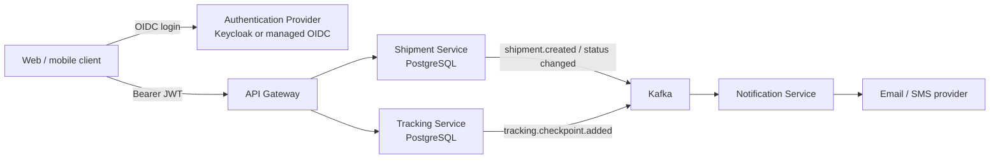

# Shipment Platform — Clean-Slate Redesign

## Scope

Build a secure shipment-management platform from scratch with these components only:

- API Gateway
- Authentication and authorization provider
- Shipment Service
- Tracking Service
- Notification Service

The SLA Monitor, SLA policies, risk scoring, ML detector, and all SLA-related fields are intentionally out of scope.

## Core design decisions

1. A user never supplies `senderId` in a shipment-create request. The Shipment Service derives the sender organization and user from a validated access token.
2. A recipient is a delivery contact, not necessarily a platform user. Recipient name, phone, email, and delivery address are stored as a snapshot on the shipment.
3. A carrier is read-only reference data in v1. Carrier administration is outside the application scope for now.
4. Shipment records are the business source of truth. Tracking checkpoints are immutable time-series data owned by Tracking Service.
5. PostgreSQL stores transactional data; MongoDB and Redis are not required for the first version. Kafka is used only for reliable cross-service notifications.

## Architecture



For local development, Keycloak is the recommended provider. In production, any standards-compliant OIDC provider can be used. The gateway validates JWT signatures and routes the authenticated request; each downstream service also validates the JWT so it is not secure only because a request passed through the gateway.

## Roles and access rules

| Role | Main permissions |
| --- | --- |
| `OPERATOR` | Create, read, and manage shipments for their organization. |
| `CARRIER_AGENT` | Add checkpoints only for shipments assigned to their carrier. |

JWT claims required by the services:

```json
{
  "sub": "user-id-from-identity-provider",
  "organization_id": "uuid",
  "roles": ["OPERATOR"],
  "carrier_id": "uuid-or-absent"
}
```

Do not trust an organization, sender, user, or carrier identifier supplied in the request body when an equivalent value is available as a claim.

## Data ownership

| Service | Owns | Does not own |
| --- | --- | --- |
| Identity provider | Users, credentials, login sessions, JWTs | Business profile and shipment data |
| Shipment Service | Organizations, memberships, read-only carriers, shipments, delivery contacts, shipment status history | Checkpoint timeline |
| Tracking Service | Tracking projections and immutable checkpoints | Shipment editing or carrier administration |
| Notification Service | Delivery attempts and notification preferences | Shipment state |

Services must not query another service’s database. They communicate through REST for synchronous reads only where needed and through Kafka events for state propagation.

## PostgreSQL schema

### Shipment Service database

```sql
CREATE TABLE organizations (
    id UUID PRIMARY KEY DEFAULT gen_random_uuid(),
    name VARCHAR(200) NOT NULL,
    created_at TIMESTAMPTZ NOT NULL DEFAULT now(),
    updated_at TIMESTAMPTZ NOT NULL DEFAULT now()
);

CREATE TABLE organization_members (
    organization_id UUID NOT NULL REFERENCES organizations(id) ON DELETE CASCADE,
    identity_subject VARCHAR(255) NOT NULL,
    role VARCHAR(30) NOT NULL CHECK (role = 'OPERATOR'),
    created_at TIMESTAMPTZ NOT NULL DEFAULT now(),
    PRIMARY KEY (organization_id, identity_subject)
);

CREATE TABLE carriers (
    id UUID PRIMARY KEY DEFAULT gen_random_uuid(),
    code VARCHAR(20) NOT NULL UNIQUE,
    name VARCHAR(255) NOT NULL,
    active BOOLEAN NOT NULL DEFAULT true,
    created_at TIMESTAMPTZ NOT NULL DEFAULT now(),
    updated_at TIMESTAMPTZ NOT NULL DEFAULT now()
);

CREATE TABLE shipments (
    id UUID PRIMARY KEY DEFAULT gen_random_uuid(),
    tracking_number VARCHAR(32) NOT NULL UNIQUE,
    organization_id UUID NOT NULL REFERENCES organizations(id),
    created_by_subject VARCHAR(255) NOT NULL,
    carrier_id UUID NOT NULL REFERENCES carriers(id),
    status VARCHAR(30) NOT NULL CHECK (status IN (
        'PENDING', 'PICKED_UP', 'IN_TRANSIT', 'OUT_FOR_DELIVERY',
        'DELIVERED', 'FAILED_DELIVERY', 'RETURNED', 'CANCELLED', 'EXCEPTION'
    )),
    origin_address JSONB NOT NULL,
    destination_address JSONB NOT NULL,
    recipient_name VARCHAR(255) NOT NULL,
    recipient_email VARCHAR(255),
    recipient_phone VARCHAR(32),
    weight_kg NUMERIC(8,3) NOT NULL CHECK (weight_kg > 0),
    declared_value NUMERIC(12,2) NOT NULL CHECK (declared_value >= 0),
    currency CHAR(3) NOT NULL,
    service_tier VARCHAR(50) NOT NULL,
    estimated_delivery_at TIMESTAMPTZ,
    delivered_at TIMESTAMPTZ,
    special_instructions TEXT,
    version BIGINT NOT NULL DEFAULT 0,
    created_at TIMESTAMPTZ NOT NULL DEFAULT now(),
    updated_at TIMESTAMPTZ NOT NULL DEFAULT now(),
    CHECK (recipient_email IS NOT NULL OR recipient_phone IS NOT NULL)
);

CREATE INDEX idx_shipments_org_created ON shipments (organization_id, created_at DESC);
CREATE INDEX idx_shipments_carrier_status ON shipments (carrier_id, status);

CREATE TABLE shipment_status_events (
    id UUID PRIMARY KEY DEFAULT gen_random_uuid(),
    shipment_id UUID NOT NULL REFERENCES shipments(id) ON DELETE RESTRICT,
    event_id UUID NOT NULL UNIQUE,
    previous_status VARCHAR(30),
    new_status VARCHAR(30) NOT NULL,
    source VARCHAR(30) NOT NULL,
    occurred_at TIMESTAMPTZ NOT NULL,
    reason TEXT,
    created_at TIMESTAMPTZ NOT NULL DEFAULT now()
);

CREATE INDEX idx_shipment_status_events_timeline
    ON shipment_status_events (shipment_id, occurred_at, id);

CREATE TABLE outbox_events (
    id UUID PRIMARY KEY DEFAULT gen_random_uuid(),
    aggregate_type VARCHAR(50) NOT NULL,
    aggregate_id UUID NOT NULL,
    event_type VARCHAR(100) NOT NULL,
    payload JSONB NOT NULL,
    occurred_at TIMESTAMPTZ NOT NULL DEFAULT now(),
    published_at TIMESTAMPTZ
);

CREATE INDEX idx_outbox_unpublished ON outbox_events (occurred_at) WHERE published_at IS NULL;
```

`version` is optimistic-locking state. `outbox_events` is written in the same database transaction as the shipment change, then a background publisher sends it to Kafka. This avoids losing an event when the database write succeeds but Kafka is temporarily unavailable.

### Tracking Service database

```sql
CREATE TABLE tracking_shipments (
    shipment_id UUID PRIMARY KEY,
    tracking_number VARCHAR(32) NOT NULL UNIQUE,
    carrier_id UUID NOT NULL,
    organization_id UUID NOT NULL,
    current_status VARCHAR(30) NOT NULL,
    last_checkpoint_at TIMESTAMPTZ,
    version BIGINT NOT NULL DEFAULT 0,
    created_at TIMESTAMPTZ NOT NULL DEFAULT now(),
    updated_at TIMESTAMPTZ NOT NULL DEFAULT now()
);

CREATE TABLE tracking_checkpoints (
    id UUID PRIMARY KEY DEFAULT gen_random_uuid(),
    event_id UUID NOT NULL UNIQUE,
    shipment_id UUID NOT NULL REFERENCES tracking_shipments(shipment_id) ON DELETE RESTRICT,
    sequence_no BIGINT NOT NULL,
    status VARCHAR(30) NOT NULL,
    occurred_at TIMESTAMPTZ NOT NULL,
    received_at TIMESTAMPTZ NOT NULL DEFAULT now(),
    scan_source VARCHAR(50) NOT NULL,
    facility_code VARCHAR(50),
    city VARCHAR(120),
    country_code CHAR(2),
    latitude NUMERIC(9,6),
    longitude NUMERIC(9,6),
    exception_code VARCHAR(50),
    description TEXT,
    UNIQUE (shipment_id, sequence_no)
);

CREATE INDEX idx_checkpoints_shipment_time
    ON tracking_checkpoints (shipment_id, occurred_at, id);
```

The client/carrier supplies an idempotency key, mapped to `event_id`. A repeated request therefore safely returns the original result. The service allocates `sequence_no` atomically and only moves the current-state projection forward according to the configured event-order rule.

### Notification Service database

```sql
CREATE TABLE notification_deliveries (
    id UUID PRIMARY KEY DEFAULT gen_random_uuid(),
    event_id UUID NOT NULL,
    channel VARCHAR(10) NOT NULL CHECK (channel IN ('EMAIL', 'SMS')),
    recipient VARCHAR(255) NOT NULL,
    template_key VARCHAR(100) NOT NULL,
    status VARCHAR(20) NOT NULL CHECK (status IN ('PENDING', 'SENT', 'FAILED', 'SKIPPED')),
    provider_message_id VARCHAR(255),
    failure_reason TEXT,
    created_at TIMESTAMPTZ NOT NULL DEFAULT now(),
    sent_at TIMESTAMPTZ,
    UNIQUE (event_id, channel, recipient, template_key)
);
```

The unique constraint makes Kafka redelivery safe: a notification is not sent twice merely because the consumer receives the same event again.

## API shape

### Shipment creation

```http
POST /api/v1/shipments
Authorization: Bearer <token>
Idempotency-Key: 0a8e7ed6-c3b7-4df0-8383-2f6666c1fcab
```

```json
{
  "carrierId": "carrier UUID",
  "serviceTier": "EXPRESS",
  "originAddress": { "line1": "...", "city": "Mumbai", "countryCode": "IN" },
  "destinationAddress": { "line1": "...", "city": "Pune", "countryCode": "IN" },
  "recipient": {
    "name": "Recipient Name",
    "email": "recipient@example.com",
    "phone": "+919876543210"
  },
  "weightKg": 1.5,
  "declaredValue": 1500.00,
  "currency": "INR"
}
```

The service derives `organizationId` and `createdBySubject` from the access token. It verifies that the carrier is active and writes the shipment, status event, and outbox event in one transaction.

### Add checkpoint

```http
POST /api/v1/tracking/{trackingNumber}/checkpoints
Authorization: Bearer <carrier-agent-token>
Idempotency-Key: 261d3c9a-260a-4b45-a8e4-00bfa71746ff
```

The Tracking Service verifies that the JWT `carrier_id` matches the shipment’s carrier. It never accepts a client-provided carrier ID for this authorization decision.

## Delivery order

1. Provision Keycloak and configure gateway + services as JWT resource servers.
2. Create the three databases and migrations above.
3. Implement Shipment Service first: ownership checks, idempotent create, state transitions, and transactional outbox.
4. Implement Tracking Service as a checkpoint timeline plus current-state projection.
5. Add Kafka consumers/producers and Notification Service idempotency.
6. Add integration tests for cross-organization access denial, carrier authorization, duplicated requests/events, and out-of-order checkpoints.

## Explicitly excluded

- SLA policies, breach calculation, at-risk queries, penalties, and SLA Monitor
- ML detection and anomaly scoring
- Redis caching until a measured performance requirement warrants it
- A separate Customer table unless the product later needs a reusable address book
